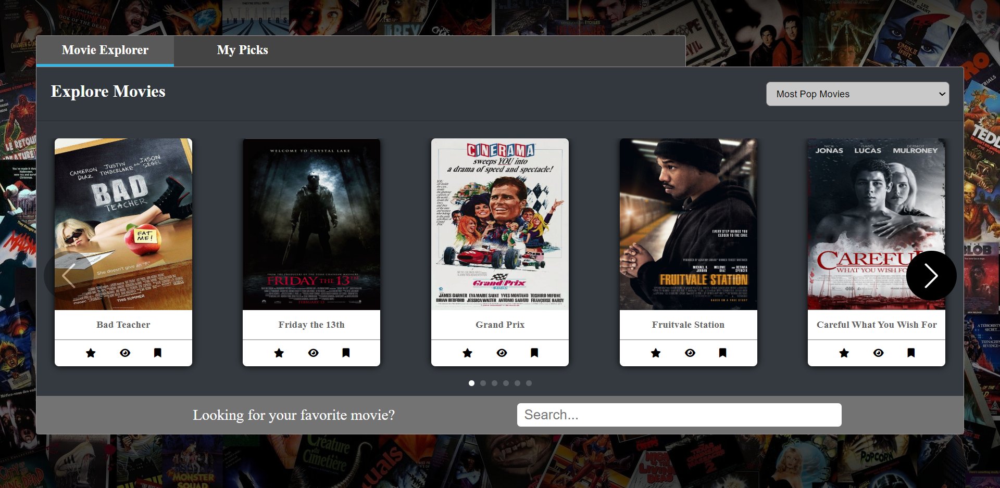
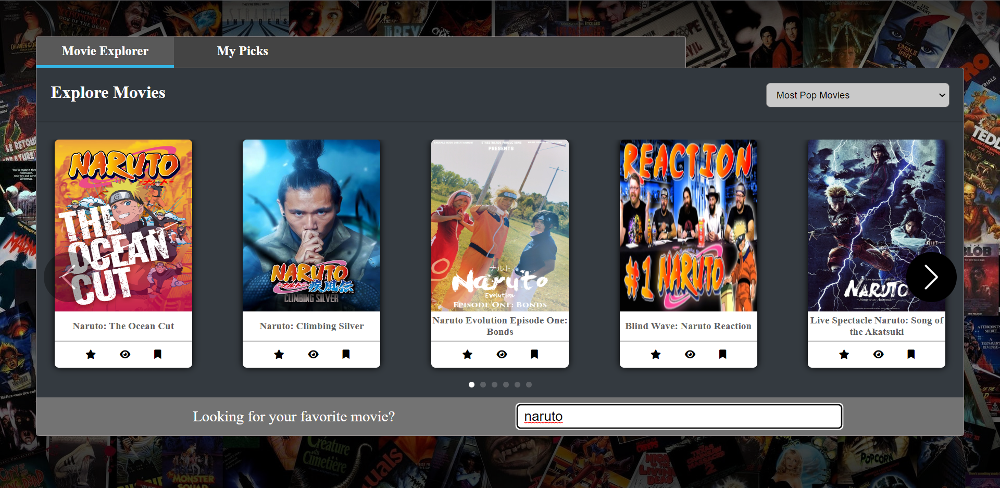
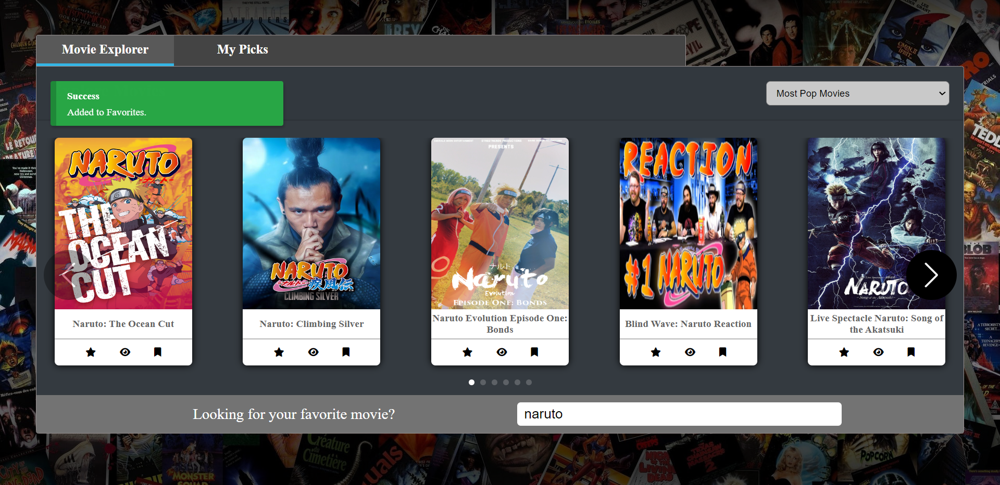
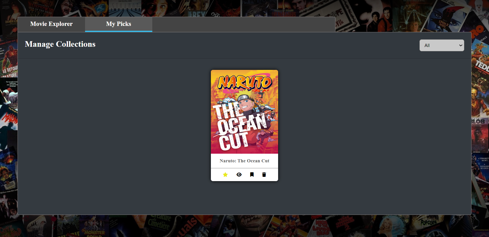
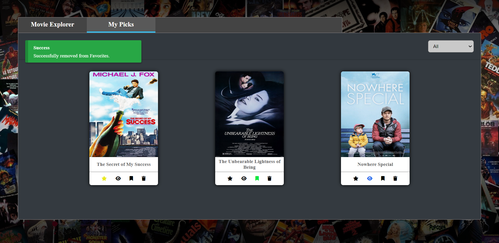
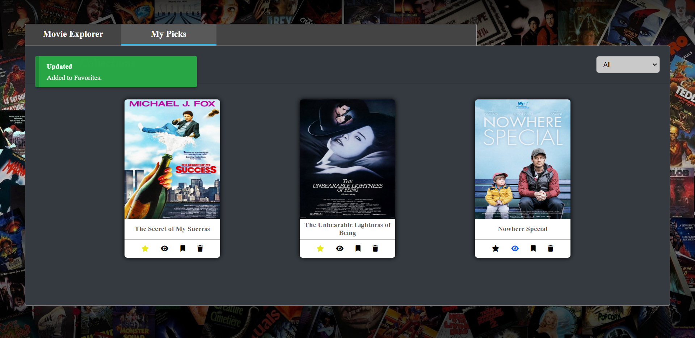

# Movie-App

This is a movie-app.
You can:
- browse movies
- search movie by name
- add to collection : favorites/wishlist/watched
- remove from collection
- change collection

# 💻Technologies

 - ReactJS
 - HTML
 - CSS
 - Jest
 - MongoDB

# 👀Screenshots

</img>
</img>
</img>
</img>
</img>
</img>

# 🏆Feedback 

Thank you for viewing my project. If you have any questions, just dm me.
